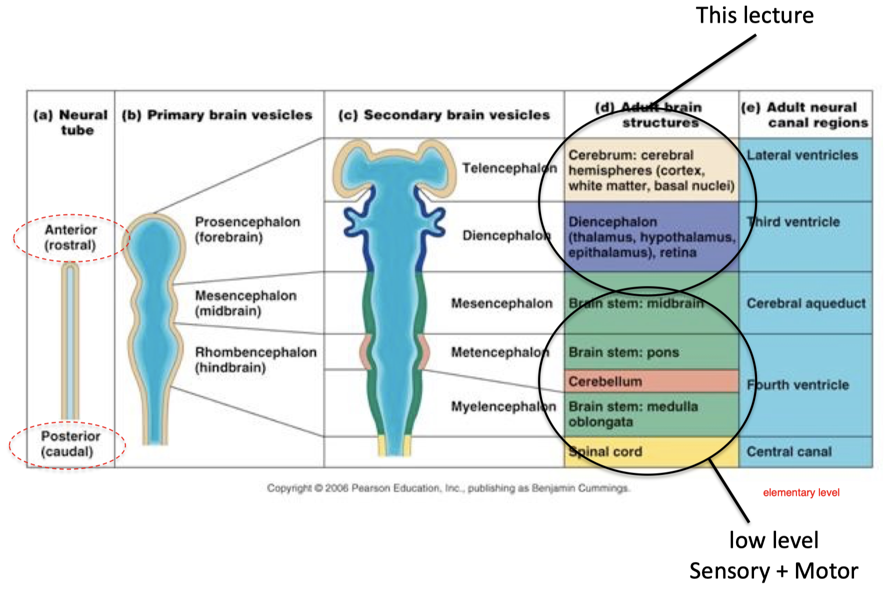
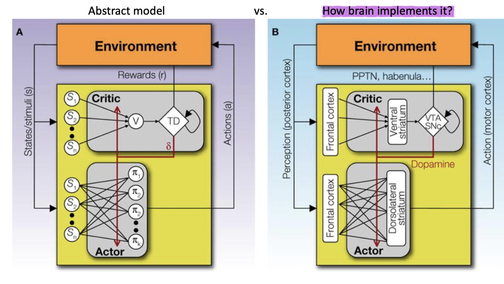
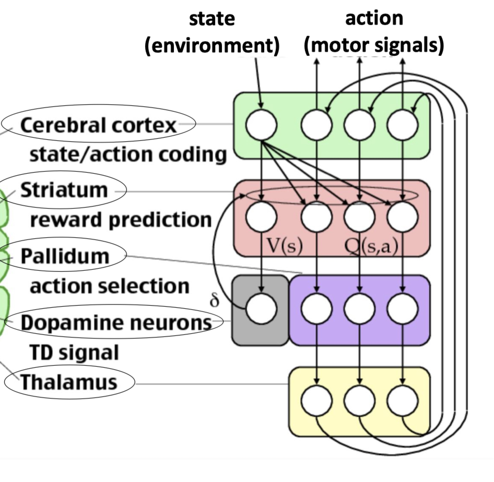
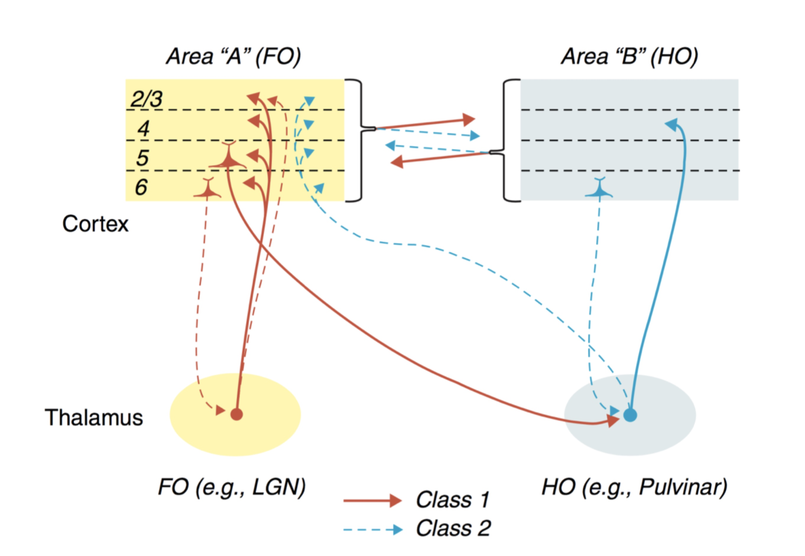

# Brain Architecture A: Cortex

- difference btw brain and computer
    - neuron have much single connection thant a transistor
    - memory and processing units/functions are not segretated

## David Marr's Tri-Level Hypothesis:
- Computational level: what does the system do (e.g.: what problems does it solve or overcome) and similarly, why does it do these things
- Algorithmic/representational level: how does the system do what it does, specifically, what representations does it use and what processes does it employ to build and manipulate the representations
- Implementational/physical level: how is the system physically realised (in the case of biological vision, what neural structures and neuronal activities implement the visual system) 
    - This is not how neuralscientist do. Too complicated

## What is it that the brains do?
- Generating and updating a predictive model of the environment/world from experience (state machine)
- Making decisions using this model of external world (decision making)
- Evaluating outcome of past decisions based on their value for survival (food, safety) and reproduction to guide future decisions (outcome prediction)
- Example of cheetah catching a deer
    - if the cheeta choose a model free decision, it will not catch the hunt. The only way it is going to suceed is to build a model of the prey,
    - it has to make prediction on what will the prey move next, from the model in his mind (which is learned from experience)
    - evaluate which action (i.e. motor signals) made in the past lead to food reward and remember this action sequence in the future
- interpreter of state, this happens in prefont layer, largest layer of brain

## Embryogenesis of the brain
- Very similar across all vertebrates
- Everything starts with the formation of a neural tube by folding of a sheet of neuronal precursors
- process of 
    - Elongation
    - Differentiation
    - Enlargement

    
- anterior (rostal)
    - Telencephalon: cerebrum (cortex)
    - diencephalon: thalamus, hippocampus
- Posterior:
    - motor sensor, etc, lower level

## Cortex
- Its size and density (of neurons) is propotional ot intelligence
- functions:
    - 1. Represents states (state machine/state engine)
        - (a) external world model, 
        - (b) internal states
    - 2. Generates intentions/goals
- Cortex is organized in anatomically segregated (yet strongly interacting) computational units.

### Parcellation of human cortex was based on focal injuries/stroke/surgeries that lead to impairments
- Frontal cortex (Phineas Gage): Failure in Valuation & Planning
    - he starts falling apart, start to do unmoral decision
- Broca’s Area (Mr Leborgne): Failure in Speech production
    - can understand speech, but cannot generate sequence of words
- Wernicke’s area: Failure in Speech interpretation
    - patient can produce sound, words , but cannot interprate them

### Techniques in neuroscience other than lesion
- Optogenetic molecular tools
    - activation: ChR2
    - inhibition: Arch, NpHR
- Brain penetrating microelectrode arrays
- In human: 
    - Deep Brain Stimulation (DBS) (Parkinson’s, Depression, OCD, Epilepsy, …)
    - Transcranical stimulation by magnetic/electric fields or ultrasound waves
    - Focal delivery of molecular-target specific drugs
### fMRI (Functional Magnetic Resonance Imaging)
- When a brain region is being used, arterial oxygenated blood flow will increase to this area.
- Local oxygenated blood has different magnetic properties that can be detected.
- pros: 
    - brain scale measurement
- cons:
    - 	not so accurate
    -  slow

### Functionally specific regions identified by fMRI
- face, body, place area, can be detected by fMRI
- “Face cells” identified by electrophysiology in monkeys

### Hierarchical organization of visual processing
- object are recognised hierachally  that has neuro correspondence, Studies by Doris Tsao and others
- Physical layout/organization of cortical areas is not random
    - visual cortex: V1 -> V2 -> V4 -> TEO -> IT
    - This is feadforward propagation, also higher level of functionality
- there is also feedback propagatoin: 
    - 1. important in feadforward learning 
    - 2. imagination, imagination can also active basic region in visual part
    - 3. Attention, feature selection.

### two major pathways for Visual processing
- Dorsal stream "where"
    - The “where” stream is next to parietal area which integrates somatosensory and visual information to create egocentric maps.
        - e.g. movement of avoidence, who you are doesnot matter I just want to avoid you
    - lesion: have trouble: which is close to cylender, landmark discrimination
- vental stream "what"
    - lesioin -> have trouble: what is the two object, object discrimination task
- in hippo information start to converge

### Physical layout/organization of cortical areas relates to functionality
- prefontal cortex: intention/Plan --> premotor cortex, motor planning area, not much detail --> Primary moter area find detail on motion
    - location information is needed for primary motor area so it is neighbor with the dorsal stream

### Physical layout/organization of cortical areas relates to functionality, II
- speech planing (broca's area) is next to face muscle
- while, speech interpretation is next to  primary auditory area
- Auditory information should be associated with visual information. 
    - Hence auditory cortex is proximal to temporal areas..
- Not every brain map is useful for understanding computations of the brain

## morphological study of Brain
### Layer Structure
- cortex is a uniform looking thin folded sheet
    - uniform -> perhaps performing similar kinds of computation (or the computation capability is very general?)
    - thin sheet of “repeating” neuronal circuit motifs
- 6 Layer structure
    - different species have layer structure, but each layer differentiated
#### “Cortical Column” Hypothesis
- Neurons in a column are often innervated by the same subcortical inputs
    - isolation of functions, within columns
- experiment on cat, for vertical and horizontal probing demonstrate this idea.

### universal “swappable” computing engines
- original connection
    - Retina --> LGN --> V1
    - Cochlea (耳蜗) --> inferior colliculus --> MGN --> auditory cortex
    - PS: I presume LGN and MGN are all in Thalamus, the sensory pathway gate, so a lot of possibility 
- experiment: lesion on inferior colliculus
    - grows the wire --> visual information to auditory corvex
- Cortex has many diverse groups of neurons with different roles and connectivity. 
    - There exist major differences in cell types and their connectivity across cortical areas.
    - machinary in the 6 layers change a lor for different sensory area.

## Brain Area separation methods
1. Using functional measurements:
    1. From response to external sensory stimulation:
    2. From responses to brain manipulations (electrical/optical/cooling..):
    - But functional studies are often insufficient to differentiate cortical areas: [Functions of many higher-order brain areas remain unknown]
2. Using connectivity differences to differentiate cortical areas:
    - sometimes, connectivity is too complicated
3. Using cytoarchitectural (大脑皮质细胞结构学) differences to differentiate cortical areas:
    
## Summary
- A model (state representation) of world: Cortex

# Brain Architecture B:  Basal Ganglia, Thalamus
## Actor-Critic model and its correspondence in Brain

- actor : dorsal striatum
- critic:
    - value : ventral striatum
    - TD error: VTA SNc (dopaminergic neuron)

- cerebral cortex: state/action coding
- striatum: reward prediction
- Pallidum: action selection
- Dopamine neurons: TD signal
- Thalamus: sensor signal pathway

## Dopamine neurons
- fire at condition (for predicted reward) and 
- also fire at reward comming, in form of TD error

## Striatum (PS: Basal ganglia = Striatum + Pallidum + ...)
- Neurons in striatum integrate/connect cortical and dopaminergic signals
- neuron in striatum: Medium Spiny Neuron (MSN)
    - connetion: VTA(dopamin) + cortex --> striatum --> Pallidum
- two type of receptor and pathway
    - Dopamine release (unpredicted reward) -> Enhance (Reduce) strength of synapses with D1 (D2) receptors
    - Dopamine depletion (predicted-reward missed) -> Reduce (Enhance) strength of synapses with D1 (D2) receptors
-  activates desired actions and inactivates undesired ones

### Convergence within basal ganglia directs appropriate action selection
- large hidden state for nature( cortex)  --> little muscle to control (down stream neurons)
    - Convergence:
        - large dendritic tree
        - decreasing cell number
- MSN takes a big roll in it, it takes hundres of cortex neuron  into action

### dichotomy of striatum, transfer of activity from DMS to DLS
- Putamen of primates ~ *DLS* (Dorsolateral Striatum) of rodents 
    - DLS required late in training
    - more connected to sensor area
- Caudate of primates ~ *DMS* (Dorsomedial Striatum) of rodents
    - DMS required early in training 
    - DMS more connected to prefontal area
- Transfer of task acquisition performance from DMS to DLS (higher order processing to lower order, sensor processing)
- When we learn how to drive, swim, we are very conscious, then it become very habitual, sequential, the higher order of brain is no longer envolved in these tasks

### Loops from cortex - striatum - pallidum - thalamus
- motor loops
- non-motor loops
- this kind of loop can be found every where, maybe cfunction for sequencial movement

## Thalamus
- Thalamus is responsible for gating sensory input
    -  very important area for consiousness
- nessecary: when you are sleep, your brain do not want to be interupted
    - electrode stimulates can wake unconsious people
    - significant change in firing in thalamus asleep/awake

### Thalamus have strong input to cortex
- thalamus to cortex connection is very specific with layers
    - In the sensor area, thalamus project to the middle layer 4 of cortical sheet,
    - then send back signals at layer 6. 
- This pattern is true through the entire cortex, with slight modification and changes.

#### Significant cortex to thalamus connection than sensor to thalamus connection
- Significantly greater cortical synapses feeding back to thalamus than synaptic inputs arising from sensory source (retina)
- very strong feedback from  cortex to thalamus, setting the information  from thalamus to visual cortex

### TRN 
- The signal go from thalamus, to cortex,they branch at TRN
- connect to TRN's inhibitory neuron, interpreted as mechanism that allows for the TRN, this sheet like structure between thalamus and cortex, to control *the gain of input* from thalamus to cortex.
- Also allows *attention signals*, from high order brain areas, to control/modulate/connect the communication btw thalamus and cortex. 

### Dichotomy of Thalamus
- sensory thalamus: first order (FO) thalamus
- rest of thalamus: higher order (HO) thalamus (Pulvinar)
- cortex connection: 
    - 1. direct 
    - 2. through thalamus (Entire cortex is connected via thalamus)
        - is sth that is quite frequent modulated by the internal state of thalamus
        - provide mechanism to control the flow of information in different cortical area.  

        

