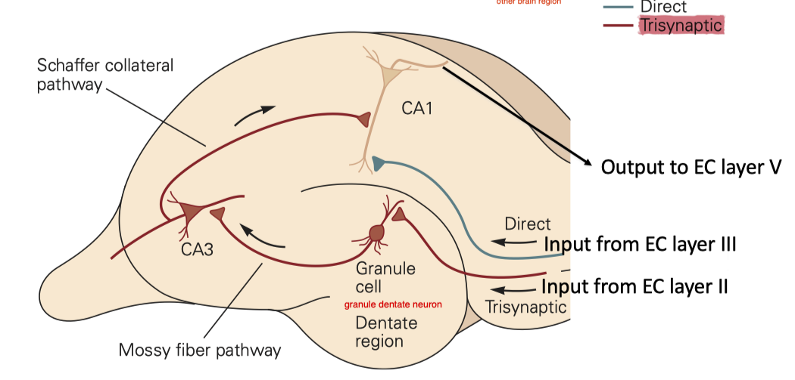
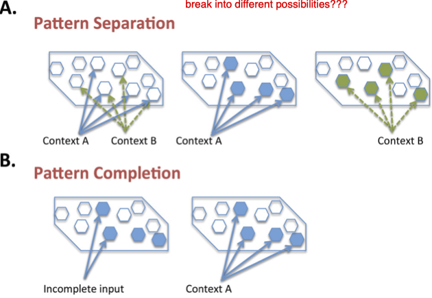
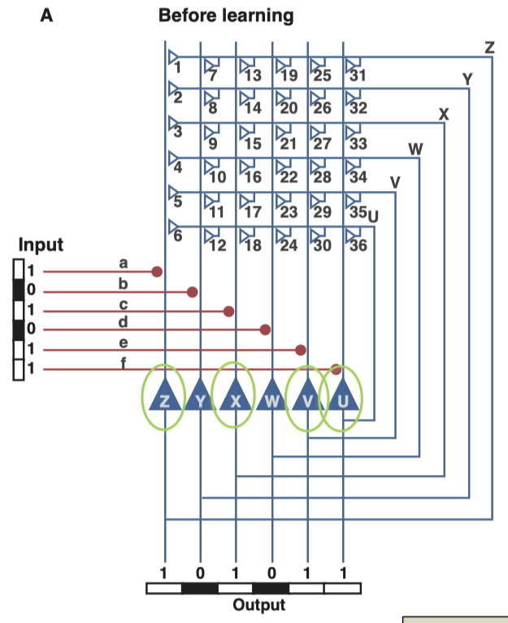
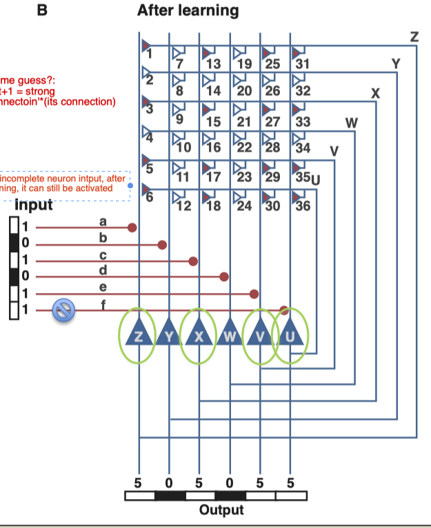
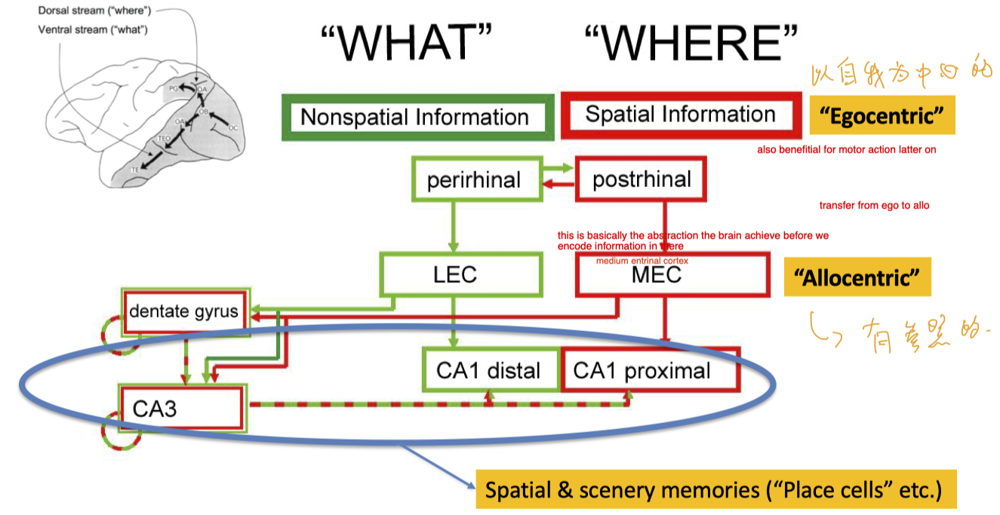
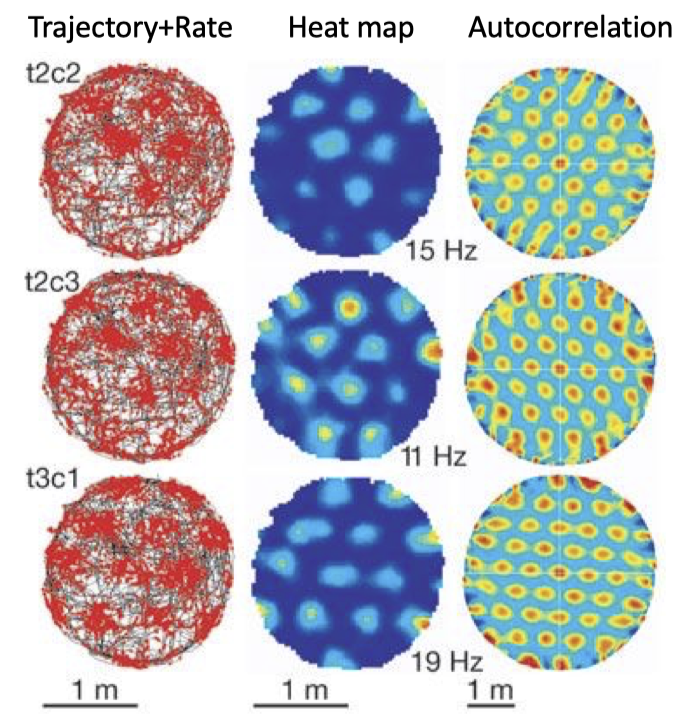

# Memory
## Learning Goals
- What is memory? 
- How and where are memories stored & retrieved in the brain?

## Outline
- Early discoveries 
- Multiple memory systems and brain areas involved
    - Short-term (working) memory vs long-term memories 
    - Implicit vs. declarative memories
- Cell assembly theory -> working memory & long-term memory 
- Hippocampus for long-term declarative memory
    - Behavior/Anatomy/Circuits
- Cellular and molecular mechanisms of long-term memory
    - Long-term potentiation (LTP) in hippocampal circuits
- Representation of scenery/place in episodic memory 
- Semantic memories: encoding & distribution

## Intro
- Memory is the process by which information is 
    - (a) encoded, 
    - (b) stored, and 
    - (c) later retrieved.
- There are several fundamentally different types of memory
- Certain brain regions are much more important for some types of storage

## Early experiment
- Ebbinghaus studied memory by using nonsense syllables: TUV, YOF, GEK, XOZ.
    - shows the forgeting behavior
- Cortical lesions impair learning/memory
    - more brain demage, more number of error in completing the maze

## Memory Processing
- Sensory input --> Sensory memory
    - unattended information is lost
- Sensory memory --attention--> Short term (working) memory
    - Maintained by rehearsal
    - unrehearsed information is lost
    - Short-term memory maintains transient representations of information relevant to immediate goals
- Short-term memory --encoded_to--> Long-term memory --can_be_retrieved_to--> Short Term memory
    - Some information may be lost over time

## Sensory Memory
- The sensory memory register is specific to individual senses:
    - Iconic memory used for visual information
    - Echoic memory used for auditory information
- Duration is very brief:
    - 150-500 milliseconds for full visual information
    - 1-2 sec for auditory information
- The capacity of the sensory register is believed to be large.
    - In the very first miliseconds, we are able to pretain much of the details of neuron activity
- Transiently stored information is meaningless unless it is selected for further processing by *attention*.

## Working Memory
- Working memory is a short-term memory system
- Storage capacity is limited: ~7 ± 2 items
- Duration of working memory is limited (by distraction): 2-18 seconds
- Information is typically (but not always) encoded vocally in working memory
- Information can be grouped and chunked in working memory to increase capacity.
    - For example, phone numbers are more easily memorized in groups, Like batch processing!
- Working memory is selectively transferred to long memory

### Cell assembly theory
#### Formation
- Hebb proposed that the internal representation of an object consists of all the cortical cells that are activated by the external stimulus.
- Reciprocal connection between neurons
1. Activation of the cell assembly by a stimulus.
2. Reverberating activity continues activation after the stimulus is removed or stimulus is repeated.
3. Hebbian modification strengthens the reciprocal connections between neurons that are active at the same time.
4. The strengthened connections of the cell assembly contain the Engram (记忆痕迹) for the stimulus.

#### Recall
- After learning, partial activation of The assembly leads to activation of the entire representation of the stimulus.

### Experiementally observed Persistent activation of cells during working memory
- Monkey experiment, some pretain object content, some location content more than 2s
- Working memory depends on persistent neural activity in the prefrontal cortex

#### Possible mechaism 1 for persistent activity: could be sustained by network connections
1. Longrange synaptic interaction
    1. Prefrontal -> Parietal -> inferior temporal
2. or Local excitatory network
3. Mutual inhibition network
- Recurrent networks of synaptically coupled neurons can lead to persistent reverberatory activity.31.08.2022

#### Possible mechaism 2 for persistent activity: could be intrinsic to neurons
- Persistent intrinsic firing of neuron
    - Strong input stimuli (plus extracellular ACh)
    - --> Burst of action potentials
    - --> Activation of voltage-gated calcium channels (VGCCs)
    - --> Opening of Ca2+-activated non- selective (CAN) cation channels
    - --> Depolarization

## Long Term Memory
### taxonomy
- Non declarative memory (*implicit memory*): we don;t have conscious access to this memory
    - Procedural memory
        - skills (motor nad cognitive)
        - biking, swimming, things with depends on, e.g., motor and cognitive skills, however these skills are difficult to explain, to express how to act individual muscle.
    - preceptual representation system
        - Perceptual priming (记忆联想? 促发)
        - Implicit rule learning
            - e.g. given distored or partially covered words picture --> recover the words
    - Classical conditioning
        - Conditioned responses between two stimuli
        - association btw rewards
    - Nonassociative learning 
        - Habituation, sensitization
- Declaritive memory (explicit memory): Type of memory that we can clearly recall that memory, 
    - Events (episodic memory)
        - specific personal experientce form a particular time and place
    - Facts (semantic memory)
        - World knowledge, object knowledge, lanaguage knowledge, conceptual priming.

## Implicit memory    
### Tasks
- Mirror drawing: watch the mirrorm and draw, skills
- Sequence/instrumental/procedural learning
    - Tasks: given number sequence, press button
        - It takes 150-250ms for information to reach to conscious level and make a decision
        - the reason for slow reaction isbecause we use a lot of the higher order part of brain
        - reaction time reduce w.r.t. time
        - You cannot play piano till you have learned it implicitly because reaction time (RT) is too slow
    - Cortex is necessary during learning. Basal Ganglia and Thalamus are essential for both learning and recall.
- Priming: Word completion
    - Tasks: given first three char of words, recall them all. For amnesic (失忆症)
        - they can not recall that they had seen these words before unless they are under priming,
        - they donnot have explicit memory for having seen it. 
    - Implicit recall requirece cortex
        - Both hippocampal lesion (AMN, amnesic patients) and M.s. (cortical lesion) lead to bad priming performance
- Implicit perceptual rule learning
    - Task: Images are degraded by a *fixed transformation* that is not explicitly stated 
        - Repeated presentation of different words -> Learning of the implicit rule

## Brain areas involved in different memory process
- Declarative memory
    - Medial temporal lobe, hippocampus, thalamus, cortex
- Nondeclarative memory
    - Procedual memory, sikkls, habits
        - Basal ganlia, thalamus, cortex (for leanring)
    - Priming
        - Neocortex, thalamu
    - Simple classical conditioning
        - Amygdala, cerebellum
    - Habituation, Sensitization
        - Early sensory and Reflex pathways

##  Declarative memory
- Episodic memory is a long-term memory system that stores information about specific events or episodes related to one’s own life/experience.
    - conscious of the hole sence
- Semantic memory is a long-term memory system that stores general knowledge.
    - fact, e.g., banana is yello. (but you cannot recall when you start to know this)
- episodic mem is essential for learning semantic mem

### Henry Molaison (H.M.) most famous patients in neuro science
- remove of hippocampus
- Healthy part:
    - sensory and motor abilities are intact
    - IQ is intact
    - short-tem memory is intact
    - Implicit memory intact
        - Ability to learn new motor skill is intact (inplicit memory, motor skill)
            - the skill is cortex dependent and is thalamus dependent. He was able to do it, a little bit slower
        - The ability to recall by priming is preserved
- Problem:
    - Could not recall memories for events up to 2 years before surgery, but older memories intact
    - Could not form new memories such as addresses, why he's in the hospital, people he met

###  Hippocampus
- at the end of the cortex
- many species have HP, hippocampus is not grow in size as that in cortex, the circuit is persisting among species

#### Anatomy

- HP is at the end of the cortex, and the very end of this side is the enthorinal cortex? ( I may mis-listen, maybe EC is next to this end)
- CA1: output information encoded to other brain region
- Enthorinal cortex (EC): Part of the cortex next to hippocampus
- all sensory cortex, visual auditory, all impinch on this area

#### Some numbers for neuron

- Entorhinal cortex (EC) layer II
    - ~200K cells (~10-20% interneurons)
    - information bottle "neck"
- Dentate Gyrus (DG)
    - ~1.2 million granule cells
    - 4K basket cells 
    - 32K hilar interneurons (20K mossy cells)
    - in AI, an enlarge in dimension is usually called *pattern separation*
- CA3/CA1
    - ~330K /420K pyramidal cells
    - for patterm completion
- Subiculum
    - ~180K cells

#### Some numbers forsynapses
- Perforant path projection (from EC) to DG
    - Around 4500 spines per granule cell (75% from EC) One EC cell makes about 18,000 synapses with granule cells
- CA3: three distinct inputs
    - 50-80 mossy fibers from DG 
    - 3,500 perforant path synapses from EC II
    - **12,000 recurrent** collaterals from other CA3 cells
    - 8,000 to basilar dendrites (stratum oriens) 
    - 4,000 to apical dendrites (stratum radiatum)
    - *Most recurrently connected area in the brain*
- CA1: inputs from CA1 and EC
    - From CA3 Schaffer collaterals: 4,500 basilar, 6500 apical synapses 
    - From EC layer III: 2,500 synapses

#### Assembly theory, or autoassociative network, explaination for high recurrency in CA3

- when some patten (101011) come, the recurrent connection amplifies the neuroconnection --> learning/change in synapses 

- for incomplete neuron intput(101010), after training, it can still be activated
### LTP and LTD
#### Long-term potentiation (LTP) in the “Schaffer collateral” pathway (i.e. CA3 -> CA1) is “associative”
- CA3 to CA1 is very largely studies, because . Because these two cells are physically separated, so that I can stimulate these neurons separately
- from past lecture, associtative means co-firing for pre and post cell

#### Long-term potentiation in the Mossy fiber 40 Direct perforant pathway pathway (i.e. DG -> CA3) is “non-associative”
- inside hippo, there are different mechanisms of plasticity.
- For example, dentate neuron to CA3. a pattern separator, the connection is in-associative, in the sense that, the two connected neuron, one from dentate, one in CA3, they donot need to fire at same time.
- So, if one CA3 neuron is silent, and the dentate it is connected to is active, this will STILL add plasticity to the synaptic. (but don;t know why this mechanism)
- different aceptor 

#### Mechanism for associative synapsee (also in lecture 03)
- NMDA: for the induction of plasticity
- AMPA:  for the maintainance and strength of the synaptic plasticity
- Mg 2+ blocks Ca 2+ transmission through NMDA receptor (NMDAR) (while post-synaptic cell is polarized)
    - activation of NMDA: 1. when glutamate is released by pre side 2.depolarize

#### Synapses collaboration
- *Normal synaptic transmission* Single synapse (not strong enough to depolarize No post-synapse) -> no LTP 
- *Cooperativity* Synapses collaborate to depolarize post-synaptic membrane --> LTP
- *Associativity* A strong synapse can help a weak synapses --> LTP
- *Specificity* unstimulated synapses next to strong synapses --> no LTP

during day, LTP is dominant, at sleep, LTD takes over, synapses can even die.

#### Signal convergence in Hippocampus
- To create a memory of an event/scene, we need to associate inputs from multiple sensory streams
- we need to converge all sensory, auditory, visual,  olfactory, visuospatial(视觉空间功能)
#### Testing memory in rodents: “Morris Water Maze”
- test: finding hidden platform in non-transparent liquid
    - mice with memory have targeted path and less searching time.
#### Mutation in NMDA Receptor blocks LTP --> no spatial memory
#### Overexpression of NMDAR subunit (NR2B) enhance LTP and also learning/memory
-  why evolution not do it??? if it is so easy???  
    -    -->> overwriting old memories, 
-    There are mechanisms that regulate the deletion of memory,

## Grid Cell and Place Cell for Event memory
- episodic memory involves presentation of places. 
- The mechanism for generating space representation, essential for generating everything else. 

- Each CA1 neuron fires at certain places but not everywhere
- Only cells with overlapping fields co-fire temporally (cell ensemble code hypothesis)
- Place cells is  observed in many species and represent 3D space in bats

### Mechanisum

- the where information is initally egocentric (以自我为中心额)
    - this is benefitial for motor action latter on
- as processing goes on the activation in Medium Enthorial Cortex is allocentric (有参照的)
    - this is basically the abstraction the brain achieve before we encode information in there
- What information and where is converged in CA3/1 in hippocampus

### Similar to place cell in CA1, grid cell is observed in MEC

- Each “grid cell” reaches highest firing rate at spatially periodic spots
- Grid cells with the same periodicity fire at shifted grid points
- Grid cells’ spatial firing periodicity the first time increases from dorsal to ventral MEC
- Brains may be using spatial Fourier transformations to construct spatial maps
- Cells in hippocampal formation also need/represent other information: “Head-direction cells” (independent of animal’s posture, landmarks)
- not only hippocampus but also prefrontal cortex PEC is necessary for episodic LTM
    - activity in both the PFC and hippocampus during and experience is essential to remember that experience

## Long Tem Facts (Semantic memory)
- events mem cannot keep for long, how to learn facts?
- Hippocampal Long-term Memory (LTM) gets “consolidated” to cortex from hippocampus
- Hippocampus replays memories to train cortex (during sleep)
    - generation of semantic memories
- Different cortical areas are involved in recall of different categories of object names
- With training, brain areas involved in recognition/recall change
    - task: read mirror-reversed text
        - before training, "where" cortex is equally involved as "what" in visual cortex
        - after training, rotation area no longer exist, only object detection "what", because the brain has already remember the correspondence
- thoughts can be verbalize, are always easy to recall and easy to translate
    - auditory have special connectivity to the front of the brain