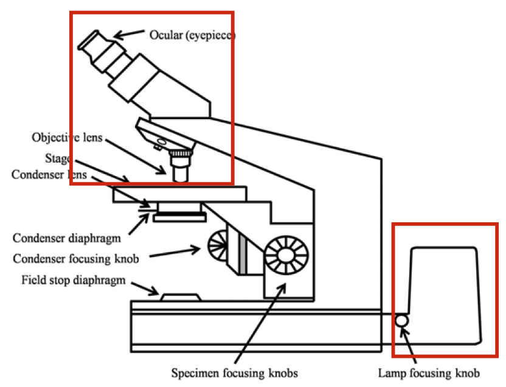

# Imaging
## Microscope

- 1/d_obj + 1/d_img = 1/f
- m = d_img / d_obj
- M = m_obj*m_ocu
- what you see on an object lens: 10x/0.25 ``\infty``/-
    - 10x means magnification
    - 0.25 means NA, numerical Aperture

### Resolution
- Rayleigh criterion ``r=\frac{1.22 \lambda}{2 n \sin \theta}=\frac{0.61 \lambda}{\mathrm{NA}}``
    - smaller r, better resolution
    - smaller wavelength --> UV
    - bigger NA

- knob gives light, the collor depends on wavelength
    - UV are weak in penetration. Red lights are better
    - UV are also poisonous for in vivo observation
- what about the camera? 
    - each pixel is projected onto the sample and we subsample the optical resolution by two or three

#### Resolution Map
- eye: 1m - 1e-4m
- light microscope: 1e-3m - 1e-7m (spine and synapses)
    - neuron is about 20 um
- electron microscope: 1e-5 - 1e-10m
    - to see vesicleas and synapses

## Electron Microscope
- Structure (Transmition EM)
    - Light source
    - condenser lens (coil)
    - Specimen (Tission)
    - Objective Lens
    - Projection Lens
    - Fluorescent Screeen (flourecense screen to transfrom electrons into lights )
- Scanning EM
    - add scanning coil (beam Deflector) before condenser Lens
        - stiring the beam focused on the prob, point by point over the prob, and for every point collecting back scattered photon, indicating which angel and material do I have.
        - if I scan very fast, i can get a complete image
    - Sample --> reflection
    - Detector on different angle 
    - --> get 3D shape

## Light Microscopy EM comparison
- WF (wild field, most simple one)
- Confocal (Lasor scanning microscope)
- 2 photon
### comparison
- EM 0.5nm
    - LM 200 nm
- mag: 250,000x in TEM, 100,000x in SEM
    - 100x for LM
- wavelength 1nm EM
    - wavelength 400-700 nm
- EM: detailed images 3D surface
    - reasonable detail with true color

- synapses can only be observed in EM
- but segmentation is a big problem
    - previously very small square, 40umx40um can be a huge data
        - laber extensive    

## Fluorescence Microscope
- genetic dye --> to certain protein, structure
    - green dye -> blue light to excite
    - a filter on both emission side and observation side to get pure color
- not only structure, we also want to observe function --> function microscopy

### Two Photon microscope

- we need super super intensive red light --> big IR lasor -> light pulse
    - For Two Photon absorption photons must be focused in space and time!
    - we use IR to focus, point by point, can collect flourecence, this is the resolution.
- lower photon energy, better penatration, less poisonous
    - 1.5mm penetration
- What are the basic components of a 2photon microscope?
    - A pulsed high power IR laser
    - a Laser scanner

### confocal v.s. two photon
- confocal: 1 phonton, but scan the layser beam
    - you will get flourecent on the cone of laser bem
- two photon: flourecent is very concentrated because it needs high concentration of photon
- 

### resolution comparision
- WF ``\Delta r \approx \lambda_m / 2 N A``
- confocal ``\Delta r \approx\left(\lambda_{\mathrm{ac}}+\lambda_{\mathrm{em}}\right) / 4 \sqrt{2} N A``
- 2P ``\Delta r \approx \lambda_e / 2 \sqrt{2} N A``
    - only depends on excitation light wavelenth

### The Light Sheet Microscope for High-throughput Imaging of large Volumes
- how can we not cutting it? keep everything as it is???
    - Clearing brain tissue - Clarity, Transparency
- remove the material that is not transparent
- brains  grows a little bit
    - structure and proteins are still intact

- illumination is in one plain. Focusing on only one dimension
    - cross section of brain is activated
    - works pretty well

## Superresolution Microscopy (STORM)
- Storm (Stochastic Optical Reconstruction Microscopy) Resolution ~ 30-50nm
- 

- special type of floure-chem, 
    - low intensity -> a small fraction of molecue get activated
    - --> subsequently right after this give a stronger pulse
    -  -> measure those individual dots of flourecent molecue
    -   --> peak is the location 
- 10000 repeated images are taken of scattered molecue
    - -> merge all this togethor
- usually only one molecue around. -> fit the peak
- Disadvantages:
    - Very slow (STORM)
    - Needs very high leaser intensities for excitation/depletion (PALM)
    - Not well suited for in-vivo applications.
    - STORM resolution is not the ‘real’ resolution

## Functional (Fluorescence) Microscopy: Calcium / Voltage Imaging
- Requires living samples (cells, mice). 
- Requires functional fluorescence indicators. 
- Requires ‘fast’ image acquisition techniques.

- Ca is a proxy for many things, might not directly related to electric part of neurons 
    - good but not perfect
- recent years, there have been voltage imaging
    - spike -> intensity went down 12,000 spike dont miss single of it

### Mechanism for Calcium Imaging
- conformational change -> makes a dye can be dyed
    - patch cell and infuse directly
- We can do genetic Calsium Indicator
    - GCamp6 RCamp, some kind of protein can be Ca2+ dependent fluorecent
- Then we can to In Vivo Two-Photon Calcium Imaging with Genetic Indicators
    - First we have to check whether flourecent can be a reliable indicator
        - do we see similar tuning property when we measure in flouricent as we measure in electrode
- why so slowly blinking? shouldn't it be milisecond scale?
    - calcium dynamics -> this is not spike signal but calcium, a integration, and time average 
    - the dynamics for flourecent to release Ca2+ is slow

## Imaging of Large Neuronal Populations Deep in the Brain

- gradient index lence /cylinder lenses
- project neuro on surface onto the top of the cylender
    - focus lights by difference of refraction rate in the material

## Question
- Can we resolve objects/molecules that are smaller than the optical (diffraction limited) resolution?
    - yes, super resolution microspy
- The confocal microscope is a wide-field microscope?
    - No. CM is scanning microscopy
- What is 4Pi microscopy?
    - two objectives, one top one bottom, much more light. 4Pi for the space angle
    - 
- STED and STORM are ….?
    - Stimulated emission depletion microscopy
    - stochastic optical reconstruction microscopy (STORM),

