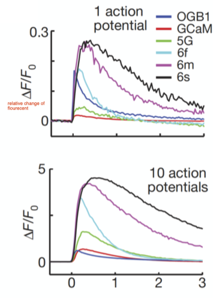
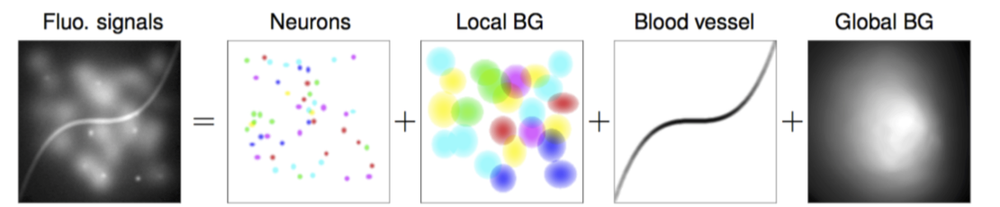
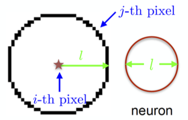
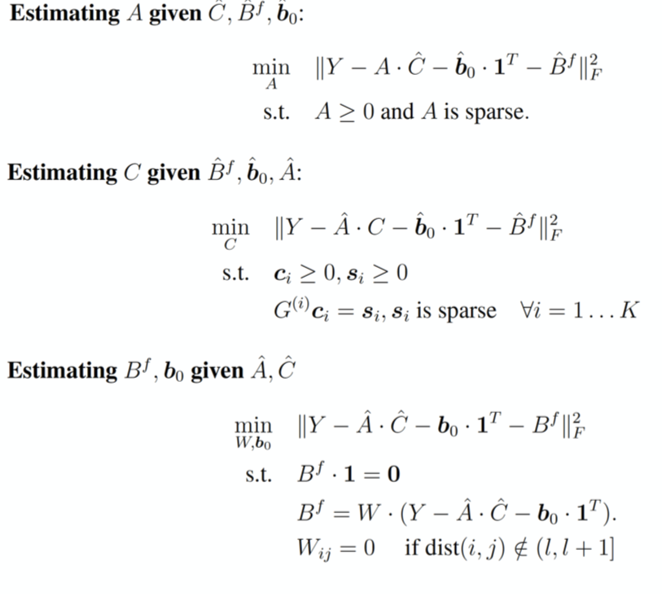
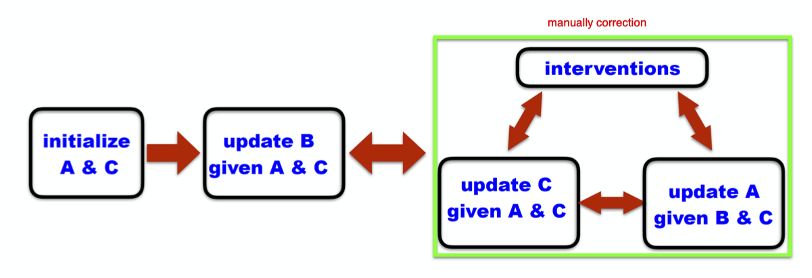

# Data Processing
## Cell Extraction from Calcium Imaging Data
### Motivation
- How does the brain encode information? “Rate or Temporal” coding
- Information coding is neuron specific: place cells, grid cells, velocity cells, head direction cells, etc…
- How does the brain guide behavior? Coordination of ensembles of neurons.

### Task
- Given a video data identiy all neurons and extract their temporal traces
- Dynamics
    - spiking activity (fast electrical)
    - intracellular [Ca2+]
    - jflourescence intensity (slow optical)

- GCaM gen xxx gets brighter
- slow because dye release Ca2+ slowly

### ROI (region of interests) analysis (manual)
1. draw neuron's RIO manually or automatically
2. extract neural activity using the summed fluorescence intensities within each ROI

#### problems
- background is a problem
    - but back grand is constant

### Decomposition of cell extraction problem
- data = neuron 1 + ... + neuron n + background + noise
    - ``Y=Y_1+Y_2+\cdots+Y_K+B+E``
- spatial-temporal activity = neuron shape x temporal activity
    - ``Y_i=a_i \cdot c_i^T, a_i \in \mathbb{R}^d \text { and } c_i \in \mathbb{R}^T``
- in general ``\Rightarrow Y=A C+B+E``
1. Finding \(A \& C\) is not easy.
2. It requires reasonable constraints to model variables.
3. The quality of cell extraction depends on -how realistic are added constraints -how well we can estimate \(A\) \& \(C\) given these constraints.

### First approach PCA/ICA
- Assumption: Neuron shapes and temporal components are spatially and temporally independent.
- procedure
    - PCA: 
        - dimensional reduction, noise removal
    - stlICA (spatio-temporal independent component analysis):
        - separation of intracellular [Ca2+] signals
    - Image segmentation
        - separation of cells with correlated signals
    - Deconvolution, event detection
        - identification of neuronal spikes and glial transients
- Problem
    - assumption is that iCA means neurons are completely independent, --> never firing together, this is against reality. there are co-firing neuron
    - this can also gives negative components

### Second Approach: CNMF (constrained nonnegative matrix factorization)
- Simultaneous denoising, deconvolution, and demixing of Calcium Imaging Data

#### Mathematical fomulation
``\begin{aligned}
&Y=\sum_{i=1}^K \mathbf{a}_i \cdot \mathbf{c}_i^T+B+E=A C+B+E\\
&\begin{array}{lll}
\hline \text { Name } & \text { Description } & \text { Dimension } \\
\hline Y & \text { motion corrected video data } & \mathbb{R}_{+}^{d \times T} \\
A & \text { spatial footprints of all neurons } & \mathbb{R}_{+}^{d \times K} \\
C & \text { temporal activity of all neurons } & \mathbb{R}_{+}^{K \times T} \\
B & \text { background activity } & \mathbb{R}_{+}^{d \times T} \\
E & \text { observation noise } & \mathbb{R}^{d \times T} \\
d & \text { number of pixels } & \text { integer } \\
T & \text { number of frames } & \text { integer } \\
K & \text { number of neurons } & \text { integer } \\
\hline
\end{array}
\end{aligned}``
- Assumption:
    - E is white noise
    - Both the spatial and the temporal components are nonnegative (A > 0, C > 0)
    - The spatial components have localized and compact footprints (A is sparse)
    - The temporal activity of each neuron obeys the dynamics of calcium indicators
        - ``c_i(t)=\sum_{j=1}^p \gamma_j^{(i)} c_i(t-j)+s_i(t) \quad \Leftrightarrow \quad \mathbf{s}_i=G^{(i)} \mathbf{c}_i``
        - s is spiking signal
    - spiking is sparse

### CNMF-E: CNMF for Microendoscopic Calcium Imaging Data
- CNMF optimized for single photon data
    - A new background model
    - A new algorithm for fitting model variables
    - A new initialization method
- Extend background:
    - 
    - CNMF fail sometime
        - because some times,  neuron is wrongly regocnized as the time-varying background.
- *Background* Assumption
    - background = fluctuating background + constant baselines
    - ``B=B^f+\mathbf{b}_0 \cdot \mathbf{1}^T``
        - fluctuating bg: ``B^f \cdot \mathbf{1}=\mathbf{0}`` 1 is time. meaning time average is zero
        - ``B^f=W B^f`, where ``W_{i j}=0 \text { if } \operatorname{dist}(i, j) \notin(l, l+1]``
            - The background fluctuation at each pixel can be represented as a linear combination of its neighboring pixels’ fluctuations.
            - l is outside center, so that nearby neuron signal cannot be considered as backgroudn
            - 
    - When number of background (BG) sources increases, CNMF-E can still estimate the background component B with high accuracy.
- Optimization separately
    - 
- Initialization
    - Raw data --spatial filtering to take out low frequency part)-->
    - Filtered data --compute Correlation and Peak-Noise-Ratio (PNR) -->
    - correlation image and PRN image
    - get singla neuron location
    - --> extracte neuron signal
    - initialization finished
- Then we do optimization iteration until converge
    - sometimes we need manually correction

### Question
-  What are two fundamental requirements for the cells extracted with the PCA/ICA method.
    -  spacial and temporal independent
-  If a neuron is never active during imaging - can it be extracted?
    -  no
-  If we image a plane/cross-section of brain tissue how can neurons overlap?
    -  overlay of neuron form different layer, soma and soma overlap
- What are the main problem when restricting/biasing cell extraction to typical somatic cell shapes.
    - some cell may be different shape --> turn them to background or signals from other cell

### 2Photon imageing
- two phonton is very thin in imageing --> no background
    - just image segmentation algorithm by DNN

    
## Spike Sorting
- multi-electrode recording
    - 300 neuron ~1000 neuron
- different neuron gives different contribution to signal depending on distance.
    - need to separate signal to different spikes
- workflow
    - raw data --filter (band pass filter 100 - 1000 Hz)-->
    - filtered data --> spike detection
    - feature extraction
    - clustering
    - spike separation
- Challenge: same cell might have different wave form, bursting or interneuron
- PCA or Discrete Wavelet Transform
    - Daubechies-8 wavelet
- Sorting is biased towards neurons with large magnitude action potentials and high firing rates
- Confounds include:
    - Neuron bursting (spikes within bursts have a different waveform).
    - Waveform overlaps of near-synchronous spikes.
    - Back-propagation of dendritic action potentials.
    - Electrode drift over time.
    - Bio-physiological differences across brain regions (CA1 vs. Cortex)