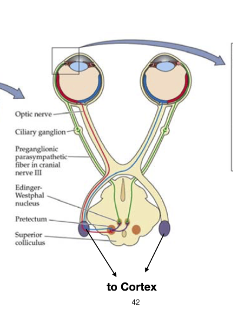
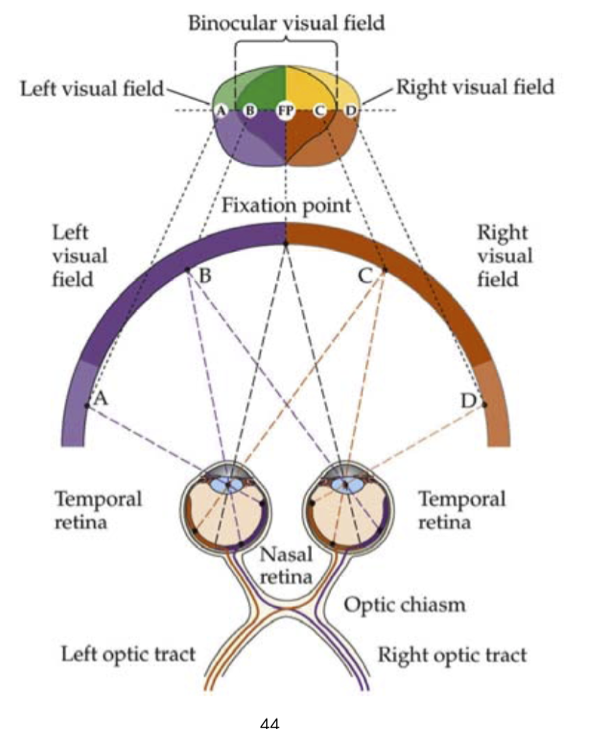

# Vision
- Out of all the five senses, vision is the most important. Most humans are fairly unique in their reliance on sight as the dominant sense and this is reflected in complex structure of the human eye. Many animals gain most of their information about the environment through their sense of smell.
- Humans perceive up to 90% of all information of the external world visually.
- Neurons devoted to visual processing take up about 30 percent of the cortex, as compared to 8 percent for touch and just 3 percent for hearing
- The human brain processes images 60,000 times faster than speech.

## Human Eye Anatomy

- color only in Macula
- focal length tuned by Iris and Ciliary muscle
- Saccades (眼动)
    - by for recturs (superior lateral medial inferior)
    - and oblique (superior and inferior) for rotation control
    - saccades is not random, it is organized for imformation search

## Retina
- amacrine, horizontal cell are latteral cell, 
    no direct input from rod and cone. 
    lateral inhibituation, make sure two cell next to each other do not fire togethor.
- only ganlion cell spike
    - bipolar cell can spike, but usually they don't
- Ganglion cell --> LGN 20cm
- Bipolar and con and rod are analog
    -  --> no spike, only depolarize/hyperpolarze
    -   --> send potential
- the synapses is also special:, analog synapsis
    -  --> continuously release neurotransmitter, but modulated by voltage analogly.
- why? spike travel with noise is reliable, analog is enough for short distance,
    - but analog have more information bandwidth

### Rods and Cones
- graded action potential, the amplitude of the potential depends on the strength
- learning is minimal in retina, maybe statistical about light

- opsin is an organic dye that obsorbs light
- procedure
    - light stimulation of rhodopsin leads to activation of a G-protein transducin
    - activated G-protein activates cGMP phosphodiesterase (PDE)
    - PDE hydrolyzed cGMP reducing its concentration
    - This leas to closure of Na+ channels
- The signal is the *reduce* in voltage, hyperpolarization
- Dark: Na influx K efflux deploarization
- Light: reduced Na influx and K efflux, Hyperpolarizaiton

#### Different response of Human Rods and Cones
- Rods have longer response time constant
    - 
- rod bipolor cell is light sensitive, while cone does not
    - 

####  Life Cycle of Disc - Retinal Epithelium
- Rhodopsin Conformational changes are reversible, but
    - it is hard to recycle these isomer
- 
    - DIscs curl
    - Tip becomes spherical
    - tip separates from rod
    - tip is engulfed by pigment epithelium
- discs move up and become distorted --> into the Etethim cell
    - takes about 12 days

#### function of Retinal epithelium
- methabolism
    - Na K glucose, Vitamin A
- Visual cycle 
    - at-RAL to 11cis-RAL
- phagocytosis (把外面挡住)
    - shed outer segments
- Growth factor
    - tell rods and cone where and when to grow
- Light absorption

#### Rods and cones profile
- luminance log cd / m-2
- Scotopic: no color
    - -6: absolute threshold for rod
    - -4: cone threshold
- mesopic: -4 ~ 0
    - 0: Rod saturation
- Photopic: good color vision, best acuity
    - 2: indoor lighting
    - 5: sunlight
    - 8: Damage possible

- distribution
    - fovea: mostly cone
    - outer: rods take dominate
- cone distribution
    - may vary due to gene (color blind)
    - mostly red > green > blue
- other animal in different range, may have 4 type of cone (4 color)
    - re-egineer of photopigment may let mouse see infer-red

#### How to get high resolution with limited amount of rods/cones?
- for human resolution, 120x60 degrees of view with 0.3 arc-minumtes resolution gives about 576mega pixel
    - but human only have 60 mega rods and 3 mega cones

### On-cener and Off-center bipolar cell

- used for point detection and for high sensitivity
- 
    - at t2, there is an activity rebounce.
- this basic computation can be extended to the basic information processing in V1 neuron, for edge detection
    - similar orientation are next to each other, --> more in higher primates, less in rodents

## Visual Pathways
- ganglion nerve ->
- Lateral geniculate nucleus (LGN)
- striate cortex (V1)
- there is also a pathway to brain stem --> sending back signals for motor control of saccade, control where to look
- nerve - brain correspondence
- 
- 

### Dorsal (where) and ventral (what) stream

