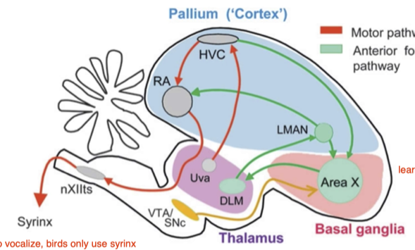
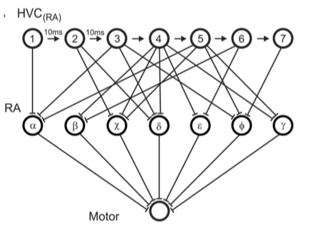
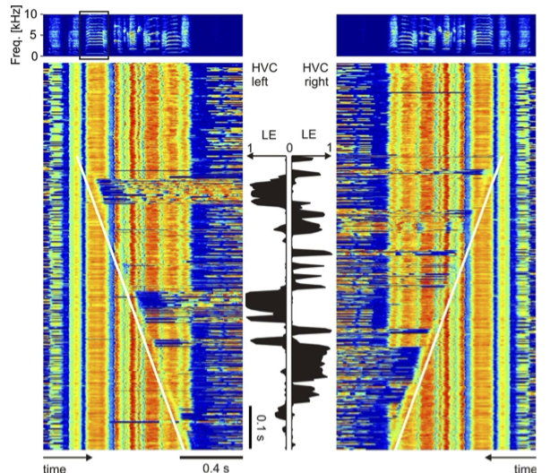
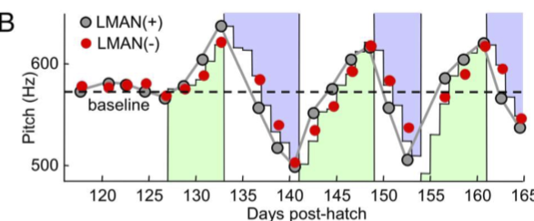

# Associative conditioning
## Learning Goals 
- Understand how animals learn from reward and punishment (conditioning).
- Understand why predicted reward is useful in models of conditioning.
- Understand the difference between positive and negative reinforcement (and punishment)
- Understand the role of reward timing.

## Classical conditioning Pavlov's experiment
- unconditioned stimulus: food
- unconditoined response: salivation
- conditioned stimulus: tuning fork
- conditioned response: salivation after the training
- If you stop pair of CS and CR, the response extinct

### reliability is highly relevant to conditioning
- if the CS and US are only 40% correlated, then there is nearly no response

### Rescorla-Wagner (RW) model
- expected reward is propotional to external stimulus: ``V=w u``, ``u=\left\{\begin{array}{lc}1 & \text { if CS present } \\0 & \text { otherwise }\end{array}\right.``
- learning rule of weight is ``w \rightarrow w+\epsilon \delta u``
    - only when u is there, the weight update
    - ``\delta = R - V`` where ``R`` is the actual reward.
- This model can model both conditioning and extinction

### RW model can also explain multiple stimuli and blocking
- When tunning fork can already explain all phenomenon, the latter appeared bell will not contribute weight because delta is zero ---> *Blocking* 
- ``V = w_1 u_1 + w_2 u_2``, when V can already be explained by ``u_1``, then ``w_2`` will always be zero, because we already have ``\delta = 0``.

## Operant conditioning 
- operant conditioning is to replace tuning fork with behavior
- given a butten, press the button then will get the food, pressing the button is the behavior.

## nomenclature of Dichotomy of reinforcement and punishment
- *Reinforcement*: method to increase certain behavior
    - positive reinforcement: Add *appetitive stimulus* following behavior to be reinforced 
        - e.g.press a button and get some food
    - negative reinforcement: 
        - *Escape*: remove an aversive stimulus following the behavior to be reinforced
        - *Avoidance*: behavior to be reinforced avoids aversive stimulus
        - loud noise is always there, but when you press button, it goes off
- *Punishment*: method to decrease certain behavior (*aversive* reinforcement)
    - *positive punishment*: Add aversive stimulus following behavior to be decreased
    - *negative punishment*: Remove appetitive stimulus following behavior to be decreased
        - e.g. press button and someone take my drinks away
- positive/negative means preference?
- This nomenclature is not rigurous, because this button can be either positive/negative reinforcement
    - in a cold environment, if you press a button, it can bring you heat, but heat can also be painful.
        - and brain can tell you the answer, by checking how reward prediction neuron encode this 

## Event timing turns reverses affective valence
- fruit fly, we give an oder A, then electrical shock 250 later, then give oder B.
- If B is before the shock, it is predictive, and the flies go away, typical punishing stimulus
- If B is after the shock, the shock turns to be a positive stimulus

## Questions
- Is aversive reinforcement the same as negative reinforcement?
    - no, it is the same as punishment, and appetitive  is reward
- According to the Rescorla Wagner rule, why does blocking occur?
    - no prediction error 
- Can the Rescorla Wagner rule explain the conditioned approach of a stimulus following a shock? 
    - Suppose you are in a not so friendly environment (shock), your expected reward for no stimulation is negative
    - no stimulus --> you will get shock => 𝑉(𝑛𝑜 𝑠𝑡𝑖𝑚) < 0 gradually
    - After stim turns on: 𝑅(𝑠𝑡𝑖𝑚) = 0 (no shock)
    - => 𝛿 = 𝑅 − 𝑉 > 0 => 𝑤 > 0: approach

## B Song System
- Know the main song-control brain areas and their neural codes underlying song production
- Understand what we learn from perturbative experiments of song-control areas
- Understand why song maintenance in adults is an active process
- Understand the neural mechanism underlying operant conditioning of song
- Understand what a forward model is and how it can give rise to prediction errors

## The song system and its underlining brain stucture

- Song birds do not have cortex, they do not have much neuron on the surface, but they have nuclues like this (Pallium)
- HVC -> RA, LMAN -> RA, LMAN -> HVC, anterior forebrain pathway (AFP), learning pathway
- syrinx: to vocalize, control the muscle, RA -> Syrinx, direct motor pathway
- VTA dopamine neuron

## RA
- RA seems very uncorrelated with the pitch, but every time a pitch appear, the neuron shows the same pattern
    - one explaination is that there is only 16 muscles and there are many ways for thousands of neurons to control these muschles, and any particlular way you pick, it looks random
- RA controls syrinx motor neuron and respiratory neuron

### Antidromic (沿着突触反方向传播) stimulation for neuron identification
- antidromic stimulation:  Put neurons in HVC and stimulate them electrically in RA, you get evoked spike in HVC
- Problem: 1. RA-projecting HVC neurons and 2. putative interneurons that could be activated from RA but not from area X, we want the first one
- Stimulation in RA, triggered by spontaneous spikes, results in spike collision for RA-projecting neurons but not for interneurons.
    - if two spikes from two direction collide, because of the refractoriness, the spike disappear
- By this you can identify 100%, what type of neuron you are recording. (HVC proj to RA, or HVC inter, or HVC proj to X
- If you chose internuron to record, the signal will not collide

### Ultrasparse code in RA-Projecting HVC neurons
- But each neuron fires at distinct time when the bird sing / call
    - This is called ultra sparse code, because the neuron fire only once during the motif
-  **call**: wine call (hungry) long call (looking for someone) alarm call. some call are learned and some are not, call can be add to syllable,
- **songs** is a string of syllables, mostly to attract female

### Modle for HVC to RA

- funciton: Add time control into the circuit, if bird make an error at particular time, it can just retune only one connection, no interference with other time.

### function of HVC
- Why HVC is important?
- This lesion experiemnt shows, if we lesion HVC, song is not sterotyped , very noisy and unstructured., like subsong, becasue subsong is generated by LMAN region (to RA), gradually, HVC take control
    - no HVC, no transition from subsong --> plastic song --> adult

#### Transsection of HVC has little effect on adult song
- Slice two part of HVC into half, the song is the same, function does not change.
    - meaning the function of HVC is very redundant and distributed.
#### Thermal Cooling of HVC slows song
- cool HVC --> slow the singing, meaning the dynamics of song is in HVC

### Electrical Stimulation in HVC disrupts song
- at different time stage of a song/syllable/motif, if we stimulate HVC, we have different result
    - truncate, 
    - distort, 
    - stop, 
    - early restart

#### Interhemispheric Switching of Stimulation Effectiveness

- sometimes, stimulate on the right/left can do the job, the other size we cannot
    - this functionality is switching
- some stimulus is very effective on the left, but not so on the right, this effectiveness is alternating, either left or right
- in Human, the area to generate speech, the left-right corresponding side have few to do with speech this switching dynamics is not in HVC, its lower.

## HVC for song stereotypy and LMAN for song variability
- inject some drugs to inactive LMAN, --> much more stereotyped for juveniles
- When you deafen the bird, the song degrade, gone. 
    - If you do deafen and lesion on LMAN at the same time, the song is preserved.

## Plasticity in adults: aversive conditioning of pitch
- If the pitch is low, you play the white noice, high, dont play

### Performance variability enables conditioning of adult birdsong
- you can either reinforce the bird to low/high pitch
    - This shows that variability injection is an active process, from that variability the bird can learn, they exploit the variability
    
### LMAN biases motor output to avoid punishment
- TTX inactivate LMAN, the pitch shift back up, this avoid of noise, it generated by LMAN,
    - inactivate LMAN, the avoidence disappear
    - 

## Dopaminergic neurons in VTA projecting to Area X
- now we have direct pathway LMAN and indirect pathway HVC --> how does thses work together? 
    - Dopaminergic neurons
- Dopamin neuron is in VTA, project to area X --> LMAN
- When the bird sing, at some period of the song, randomly (50%) do some stimulus, loud and annoying, punishing stimulus, to study what happens to VTA neurons
    - When the stimulus occurs, there is a decrease in firing of VTA,
    - when stimulus is not happening, in crease in firing
- This is a process of reward prediction error.
    - delta = R -V is propotional to firing rate

### Optogenetic Manipulation of VTA Terminals in Singing Zebra Finches
- You can modulate these neurons, you take optogenetic construct, .e.g excitable photo sensitive channel to 
    - activate neuron with light --> fire more, 
    - or inhibitory --> fire less  --> expect the song to change to one direction or another.
- in this experiment, punishment is realized by decrease in firing of VTA neuron, reward is increase, done by optogenetic manipulation.
    - punishment is not by stimulus. but direct manipulation on VTA
- firing in VTA is no only correlate with learning, but the sight of learning. 
- you infect neurons in VTA, and put like on area X, then only neuron projection from VTA to X can be activated. 
    - --> effectively trigger local release dopamin, even though this neuron does not fire
    - result: stimulate on low pitch --> pitch down, stimulate on high pitch --> bird pitch up, this is like a positive reinforcer. --> appetitiveness 
    - ChR2 is excitatory
- similar results for inhibitory treatment,
    - ArchT is inhibitory --> This is a punishment

### Diverse perturbation responses in auditory cortex (field L)
- Study doen in auditory corvex, 
- we perturb the song with stimulus in auditory cortex, you randomly pick a syllable, and 50% present a stimulus
    - the neuron is a detector of prediction error, maybe the Abs(\delta), most firing happens in stimulus
- The mechanism in VTA is already in auditory system, way higher up.
- I don't understand this

#### Forward models and prediction errors
- this is a bit like delta
- sensory to motor neuron mapping is forward, motor to sensory mapping model is inverse model
- forward means this is along with the direction of causality

signal --> neuron --> motion

inverse model is opposite: I tell you a word you never hear --> please imitate, --> you have  to listen  --> auditory corvex --> predict what moter commands to generate 

every animal have a forward model

## Question
- Why does the neural representation of a song in HVC (RA) neurons minimize synaptic interference during song learning, assuming adult song is stored in synaptic weights between HVC and RA?
    - better control for particular part of pitch
- What does the bilateral transection experiment tell us about the HVC network?
    - HVC is very redundant and distributed in functionality
- Why do we believe that the AFP contributes to song maintenance in adults based on errors conveyed by auditory feedback?
    - deaf --> subsong
- What are evidence for LMAN injecting bias and variance into songs?
    - no LMAN --> less variance
    - no LMAN + deaf adualt --> maintainence
- What is the evidence that Area X implements reward prediction error minimization?
- What does ‘forward’ mean in a forward model ?