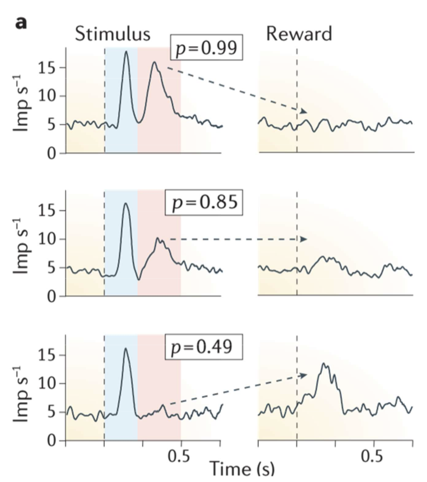
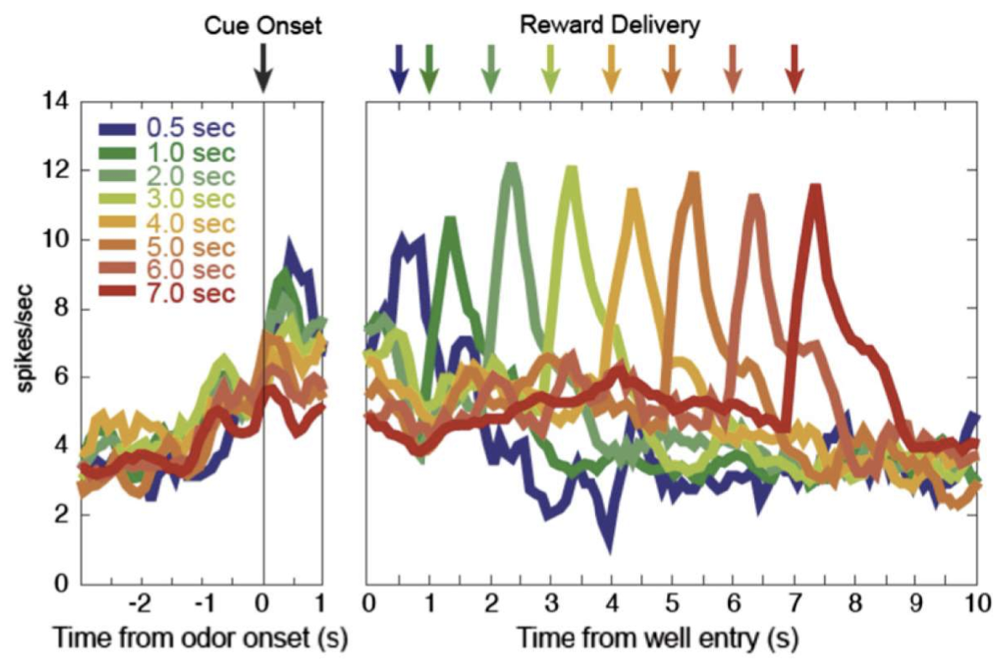
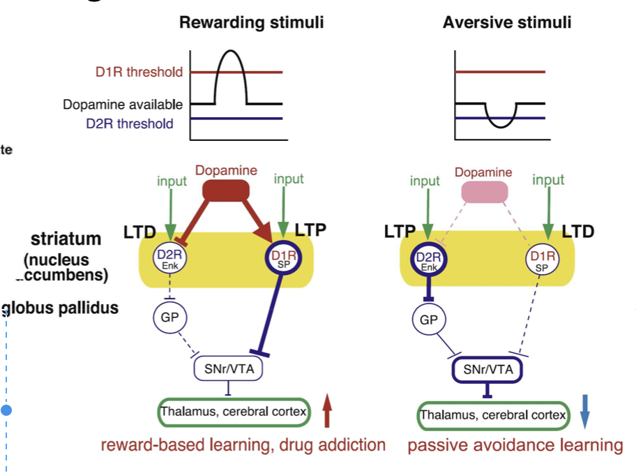

# Dopaminergic system
## Learning Goals
- Know the basic anatomy of neuromodulatory systems
- Know example circuit functions that are neuro-modulated
- Understand the relationship between dopaminergic responses and reward
- Understand the modulatory effects of positive and negative dopaminergic responses
- Understand in what way Parkinson’s disease impairs learning

## Major neuromodulator pathways
- neuromodulator neuron: a small group of neurons belonging to small nuclei in the brain stem innervate the entire brain
- Neuromodulators are often thought to convey global control of brain states that underlie different behaviors, such as sleep and arousal.
- *Dopaminergic* (多巴胺) system: substantia nigra and ventral tegmental area (VTA).
    - Dopamine is synthesized in three steps from the amino acid tyrosine. 
    - It is associated with reward mechanisms in brain and generally involved in regulatory motor activity, in mood, motivation and attention.
- *Serotonergic* (血清素) system:
    - Serotonin (5-HT) is synthesized in two steps from the amino acid tryptophan. 
    - It regulates attention and other complex cognitive functions, such as sleep (dreaming), eating, mood, and pain. 
    - Too little serotonin has been shown to lead to depression, anger control etc.
- *Noradrenergic* (去甲肾上腺素) system: 
    - (noradrenaline) is synthesized directly from dopamine within vesicles. 
    - Norepinephrine is associated with bringing our nervous systems into "high alert“, 
    - it increases our heart rate and our blood pressure, it is also important for forming memories.
- *AcetylCholinergic*  (乙酰胆碱) system: 
    - Acetylcholine is responsible for stimulation of muscles, including the muscles of the 3 gastro-intestinal (消化道) system. 
- All four major neuromodulators tend to be *excitatory* in their effect.

## Neuromodulator act at different level on the neural circuit
- synaptic strength: The effect of modulators can switch the sign of synaptic dynamics from depression to facilitation.
- Synaptic dynamics: The LTP and LTD components of spike-timing-dependent plasticity (STDP) are controlled by modulators.
    - no dopamine: nothing change
    - normal is STDP (P/D depend on spike time sign)
    - norepinephrine --> LTP (independent of timing)
    - acetylcholine --> LTD (independent of timing)
- Ion channels and membrane excitability
    - 5-HT (serotonin) can functionally silence synapses in the crustacean stomatogastric ganglion (STG), 
    - whereas dopamine can unmask synapses that are normally silent.
- A great tool to study is photongenetic, whether animal change behavior under light

## response of Dopaminergic neuron
- no condition stimulus (CS) only reward (R)
    - -> increase (in firing) happens at R
- CS + R --> increase happens at CS
- CS + no R --> increase also happen in CS, decrease in R (this is a negative prediction error)

### Dopamine neurons code errors in the prediction of both the occurrence and the time of rewards
- ``\delta=R-V`` (this is why the at reward time there is not peak)
- Reward delay by 0.5 s leads to considerable depression at the habitual time of reward and activation at the new time.
- Earlier reward leads to activation at new time but not to major depression at the habitual time.

### predicting reward are proportional to the magnitude of the predicted reward
- The signal is propotional to the reward, analog signal
- also responds to the *probability* of reward

### Further experiment on reward probability

- left (first peak) is the current by stimulus, 
- a few miliseconds laterm the identity of stimulus is identified (second peak).
    -  If the probability is high (certainty) then there is a high second peak response, but when the actual reward come, there is no respons
    -  so this second peak encodes the certainty (percepted by creature) of the upcoming reward

- Change the reward time, the estimation of when reward will come are reflected in neural response
- the more delay, the less response at Condition Stimulus time, (known as *delay attenuation*)

## Neuro connection behind

- Preference and avoidence are controled by different pathways and receptors.
- receptors activated by different dopamine threshold
- The direct pathway is *excitatory* and is in charge for the *initial part of movements,* 
- while the indirect pathway is *inhibitory and prevents unnecessary movements*. 
- There are diverse experiments that suggest diverse roles of the two pathways in reward-based and in avoidance learning, distinctly controlled by *separate dopamine receptors*.
    - Dopamine D1 receptors in the direct pathway have a high threshold for activation 
        - Positive reward prediction errors will activate the direct pathway to trigger learning of actions that lead to reward,
    - whereas D2 receptors in the indirect pathway have a low threshold. 
        - whereas negative reward prediction error will disinhibit the Globus Pallidus (GP), which leads to action avoidance.

### Prove of different pathway on Parkinson Patient
- parkinson patients, their dopamine neuron dies
- they can learn either by liking some or unliking other one. 
    - Normal people are equally good at both, 
    - but parkinson are more likely to avoid.
- given drugs they learn to select

## Question
- Why do dopamine neurons not encode reward prediction?
    - Because they only fire/ zero fire when prediction is not the same as reward
- Which properties of dopamine neurons agree with the Rescorla Wagner rule? Which do not?
    - 1. Firing proportional to reward
    - 2. dopamine encodes delta, but RW says about V. 2. Dopamine also encode time delay and probability.
- How do we know that dopamine is differentially involved in appetitive versus aversive learning?
    - There are Two different receptors and two different pathways
- How does Parkinsonism relate to making positive choices versus avoiding negative choices? (is the function of the direct or the indirect pathway impaired?)
    - Function of direct pathway is impaired
