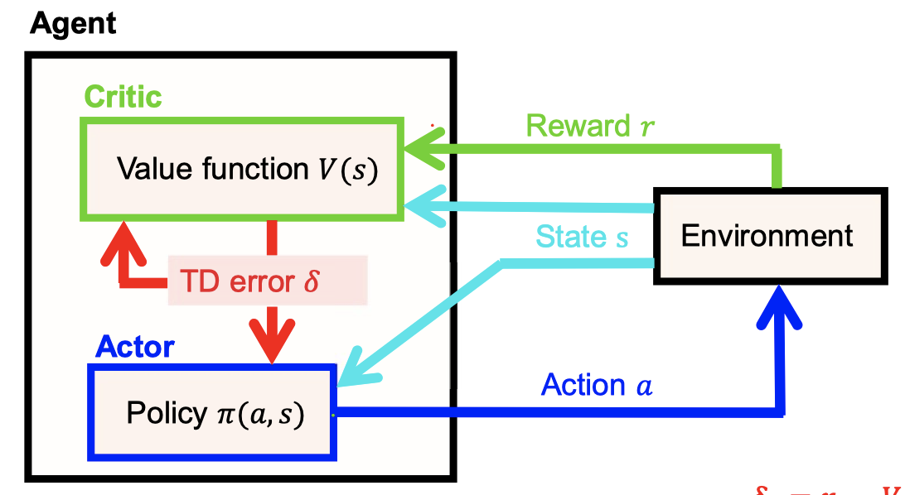
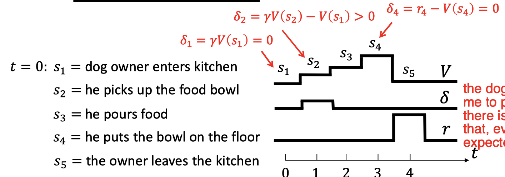

# Reinforcement Learning A
## Question
- In what kind of situations do we realistically have access to world models ``P^{a}_{ss}`` and reward models ``R^{ra}_{ss}``?
    - Maze, games, rules clear, reward clear, atari games. fully observable games.
- How does the computational complexity of finding the optimal value function ``𝑉^∗`` depend on the number of states ``N_s`` in the world and the number of possible actions ``N_A`` of the agent ?
    - NaNs^2 per iteration cost
- Is it straightforward to generalize the Bellman equation to continuous state and action variables?
    - Hard, none trivial, probability needs to be normalized to 1.
- Are there alternatives of expected return that we may want to maximize?
    - think about going to a casino, you can only have few trial, reward will not converge to average.
    - the maxmin result. Expercation is only a number, but we want the distribution of reward, e.g. expectile.
    - simplicity of policy?

# Reinforcement Learning B
## TD Learning
- ``V^{k+1}\left(s_{t}\right)=V^{k}\left(s_{t}\right)+\alpha\left(r_{t+1}+\gamma V^{k}\left(s_{t+1}\right)-V^{k}\left(s_{t}\right)\right)``

## Actor-critic model

- The TD error is used to train the state value predictions ``𝑉(𝑠)`` in the critic, as well as the policy ``\pi(s, a)`` of the actor.
- actor does not receive explicit reward information about the actual outcomes of its actions. 
    - Rather, the TD prediction error serves as a surrogate reinforcement signal, telling the actor whether the

#### Example- the dog does not expect me to pick the bowl, so there is this delta, after that, everything is expected

### On-policy TD Learning for Q function: SARSA
- ``Q^{k+1}\left(s_{t}, a_{t}\right)=Q^{k}\left(s_{t}, a_{t}\right)+\alpha\left(r_{t+1}+\gamma Q^{k}\left(s_{t+1}, a_{t+1}\right)-Q^{k}\left(s_{t}, a_{t}\right)\right)``
- ``a_{t}= \begin{cases}\operatorname{argmax}_{a} Q^{k}\left(s_{t}, a\right) & \text { with probability } 1-\epsilon \\ \text { random action } & \text { with probability } \epsilon\end{cases}``
- the history influence the greedyness through bad experience?

### Off-policy TD Learning RL: Q-Learning
- ``Q^{k+1}\left(s_{t}, a_{t}\right)=Q^{k}\left(s_{t}, a_{t}\right)+\alpha\left(r_{t+1}+\gamma Q^{k}\left(s_{t+1}, a_{t+1}\right)-Q^{k}\left(s_{t}, a_{t}\right)\right)``
- ``a_{t}=\text { random action choice }``

## Exploration v.s. Exploitation

## SARSA v.s. Q-Learning
- CLiffwalking: SARSA achieves higher reward but Q learning is optimal. because Q-learning is always trying dangerous path, while SARSA is always on the safer region
    - SARSA takes the consequences of such exploratory actions into account and takes the safer route.
    - If the amount of exploration is reduced in time, both algorithms will converge with prob. 1

## Question
- What is the difference between TD learning and the Rescorla Wagner rule?
    - Time, we have that in TD learning, discount.
- In what way does the TD learning rule agree with delay attenuation of dopaminergic neuron firing?
    - explain if the reward comes really late you have less firing, --> less expercted return. 
    - the gamma term?
- What advantage do Q functions have over value functions?
    - value funciton: state, Q: state action pair
    - more directly tells you which action to choose
- What is the difference between on-policy and off-policy learning?    
    - on policy: express the fact --> you know a bit what is good, you choose by this which is a trade-off
    - off policy: completely random