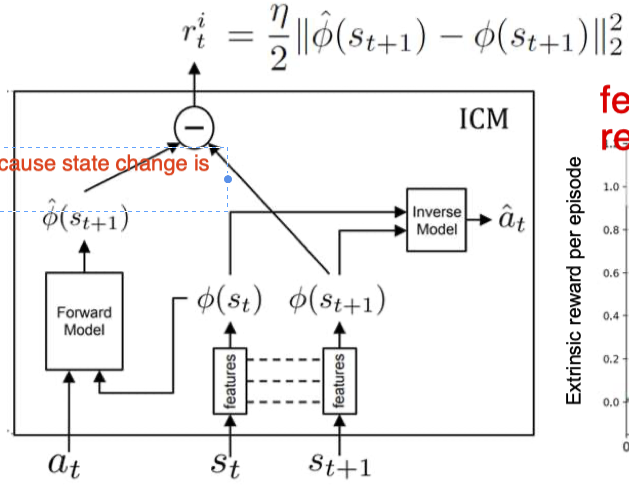
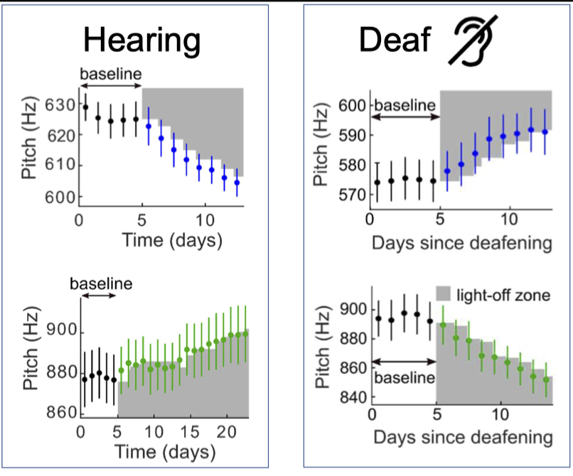
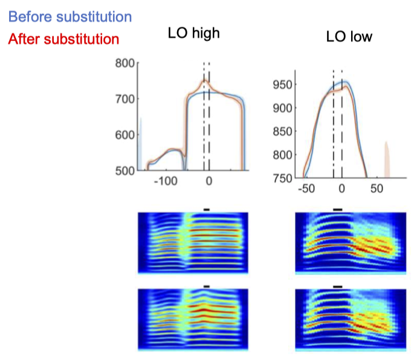

# A Curiosity
## Learning Goals
- Understand what is intrinsically motivating to animals
- Why should reinforcement learning theory care about intrinsic motivation?
- Learn about increasingly more complex methods of directed exploration (seeking information)
- Learn to constrain information gain to useful properties of the environment

## Intrinsic motivation
- WWII, psychologist was dominated by German, like Floyd, simple idea that basic drive of sex, food, etc.
    - American link motivation to other.
- Possibly:
    - Exploration: novelty seeking, curiosity
    - Activity: jogging, swimming
        - being allowed to run is like a food, giving a hamster a wheel --> it will run
    - Manipulation of object: music, games
- This lecture we will focus on 
    - Curiocity (knowledge gain, directed exploration)
    - Playfulness (manipulation gain)
- Original problem of exploration and exploitation trade-off, but in CS, RL is not so good at exploration.

### Softmax exploration 
- ``\pi\left(A_t \mid S_t\right)=\frac{e^{\beta Q\left(S_t, A_t\right)}}{\sum_a e^{\beta Q\left(S_t, a\right)}}``
- The denominator assures that probabilities of all actions sum up to 1
- Parameter 𝛽 controls the exploration/exploitation tradeoff:
    - ``𝛽 = 0``: random action choice (pure exploration)
    - ``𝛽 → ∞``: greedy action choice (pure exploitation)
-  As with ``𝜖``-greedy, ``𝛽`` can be made to depend on the performance
    -  Both ``𝜖``-greedy and softmax depend on one parameter, which method works better depends on the task

### Directed exploration
- Cons of random exploration in Q-Learning:
    - World knowledge, gathered through experience, is not utilized to guide exploration (more so with 𝜖-greedy SARSA)
    - More explored state-action paths are not less favored for exploration (even under softmax)
        - Softmax would not take into account how many time you have explore the path already.
- The goal of directed exploration is to bias action selection to special choices (infrequent choices, or informative choices, or intrinsically motiving choices, …)

#### DE: Exploration Bonus
- k-Armed bandit:
    - ``\pi\left(A_t\right)=\frac{e^{\beta Q\left(A_t\right)+\varphi \sigma_R\left(A_t\right)}}{\sum_a e^{\beta Q(a)+\varphi \sigma_R(a)}}``
    - ``\sigma_R\left(A_t\right)`` uncertainty
    - ``\phi`` weight
- attraction by novelty, but also by randomness (which can become a problem)

#### DE: counters
- **Counters** ``C(s, a)`` of state-action visits can serve as an exploration bonus to help select rare state-action pairs. E.g. prefer an action when ``C(s, a)`` is small.
    - But counters are inefficient in high-dimensional state-action spaces.
    - Also, counters make use of only immediate value of exploration, not its future consequences (as in immediate vs. delayed reward).
        - the bridge problem: Imagine you are on an island, don;t go on the bridge, you have gone 10 times! (counter)
            - If you consider the further, there are much more possibliyt --> go
            - bridge is just a bottleneck, and the world behind that bridge is so much to explore, we need to ignore this short passage
    - These days, people have not only record explored or not, but also the *relative consequence.*

#### DE: Exploration values
- As a generalization of counters, exploration values ``E(s, a)`` are a modelfree method to take into account these consequences. 
    - The idea of exploration (``𝐸``) values is analogous to learning 𝑄 values using SARSA, but in a parallel ‘0-reward environment’.
    - pretending we do SARSA, but we have no reward ever. initial value of 1. (E initial acts as reward, every thing is worth exploring)
- ``E\left(S_t, A_t\right)=E\left(S_t, A_t\right)+\alpha\left[0+\gamma_E E\left(S_{t+1}, A_{t+1}\right)-E\left(S_t, A_t\right)\right]``
    - by this gamma, you eat your exploration bonus.
- ``\tilde{R}_{t+1}=R_{t+1}+1 / \log _{1-\alpha} E\left(S_t, a\right)``
- Special case for ``\gamma_E=0``
    - ``E=(1-\alpha)^n``
    - ``\log _{1-\alpha} E=n`` -> ``\tilde{R}_{t+1}=R_t+1 / n``
- experiment results shows Faster convergence

## TV Problem
- How can we prevent a knowledge-driven agent from getting stuck in front of a computer screen that displays random stimuli (which are the most absorbing stimuli, e.g. E values)?
    - Distinguish between self-generated and external (meaningless, random) stimuli.
    - there might be external state that cannot be controled by any action, this can be an extraction when we use the previous methods

### Curiosity with forward-inverse models

- inverse model: Learn *feature space* ``Φ(𝑠)`` by trying to reconstruct the action ``a_t``  from (``s_t, s_{t+1}``) (inverse model).
    - for the TV problem, this is not successful, because state change is not generated by action. 
    - the state between TVs cannot generate an action, then it is not an effective changable stage, it cannot develop any feature tuning,--> it will not have neurons that have response to changes in screen
    - the inverse model is also trained, meaning that noisy tv will not be an effective predicting feature, so it will be ignored in feature space.
- forward model: In this feature space, predict the next-state representation ``\Phi\left(s_{t+1}\right)`` from ``\left(\Phi\left(s_t\right), a_t\right)`` (forward model).
- intrinsic reward: ``r_t^i=\frac{\eta}{2}\left\|\hat{\phi}\left(s_{t+1}\right)-\phi\left(s_{t+1}\right)\right\|_2^2``
    - feature space as intrinsic reward
    - Like if you make an error, you should probably explore more. you are attracted by uncertainty and ignorance  --> 
    - cannot solve the TV problem,Typically we are not so attracted by uncertainty, but certainty
- Also shows faster convergence.

## Questions:
- What is the idea of directed exploration?
    - Direct explore by knowledge known/explored so far
- In what way are E values better than counters for directed exploration?
    - you can avoid stuck by bottleneck
- When do even E values fail to yield a good strategy of exploration?
    - when you have too many states, few not controlable state,
- How does Pathak’s (forward-inverse) agent react to the noisy TV program?
    -It would not learn the state? ignore the feature?
- How does the forward-inverse agent react to an unpredicted state ``s_{t+1}`` that can be triggered from a given state-action combination? And what if that state becomes well predictable?
    - 1. a lot of intrinsic reward
    - 2. not so much intrinsic reward

# B Playfulness
## Learning Goals
- Attempt to define a computational modularization of intrinsic motivation.
- How to distinguish playfulness (manipulation seeking) from curiosity (knowledge seeking).
- Learn about a sensory substitution experiment revealing a manipulation drive.
- Understand simple models of playfulness

## Manipulation drive vs knowledge drive
- Manipulation seeking can be preferable to knowledge seeking because the former provides a principled way to avoid the noisy TV problem (distinguish relevant from irrelevant knowledge).
    - forward inverse model is already some sort of manipulation driving
- How to distinguish manipulation seeking from knowledge seeking (e.g. curiosity with forward-inverse models)?
    - curiosity gets consumed with time, playfulness does not.
- Example: design sensory substitutino for blind people
    - for blind people, give then substitution signal, problem is that blind, they don't like these
    - An important question for research are the guiding principles of sensory substitution that indicate whether a device will be acceptable by patients.
    - sensory substitution reveals a manipulation drive…

## Bird song behavior study
- Experiment: replace sound feadback by light, we design a system to recognize syllables, when a particular syllable appear the light goes down for 100ms

 
- we only turn the light off when pitch is low --> 
    - normal bird does not like light off, disturbed , 
    - but deaf bird have counter trend, they decrease the pitch
- it have nothing to do with light off turn from dislike to like, we can change the response to turn light up, brighter, and the trend is still the same

- birds can change there pitch in really focus manner, the pitch change is very accurately in the detection window, minimum change.
- LO seems punishing for normal birds but rewarding for deaf birds.

### Hearing loss flips the valence of a visual stimulus
- Hearing birds: LO decreases their tendency to sing by 17%.
- Deaf birds: LO increases their tendency to sing by 80%.
- tendency is the overall frequency in a day a bird sing
    - --> deaf birds are more willing to sing

### Feedback must be reliable
- bird cannot control --> reduce singing rate
- cannot control it --> stop doing it

### Models behind (knowledge + manipulation bonus)
- bird have 18 state (nodes), and have 24 actions
    - only some of the pitch frequency trigger light off
- Bird's internal knowledge on transition: ``P(\text { state } k \mid \text { action } j)=\vartheta_j(k)`` where ``\hat{\vartheta}_j^t(k)=\frac{1+C_{j, k}^t}{1+\sum_l C_{j, l}^t}``
    - ``C_{j, k}^t=\left\{\begin{array}{cc}\tau \cdot C_{j, k}^{t-1}+1 & \text { for } k=k^* \text { and } j=j^* \\C_{j, k}^{t-1} & \text { otherwise }\end{array}\right.``
    - ``\tau`` models a forgetting rate to mimic bird's limited counting ability
- update" ``Q_{j^*}^t=Q_{j^*}^{t-1}+\alpha\left(R_{j^*}^t-Q_{j^*}^{t-1}\right)``
    - We first assume light of is intrinsically punishing, then we  try to add knowledge bonous and manipulation ponus.
- bonus ``R_{j^*}^t=E_{j^*}^t+M_{j^*}^t+r^t``
- **Knowledge Bonus** ``E_{j^*}^t=\log D_{\mathrm{KL}}\left(\hat{\vartheta}_{j^*}^{t-1} \| \hat{\vartheta}_{j^*}^t\right)`` this is how much you learned indicated by probability change
- **Manipulation bonus**
    - ``M_{j^*}^t=D_{\mathrm{KL}}\left(\hat{\vartheta}_0^t \| \hat{\vartheta}_{j^*}^t\right) \stackrel{\text { deaf }}{=}-\log \hat{\vartheta}_j(\text { on }) \simeq \hat{\vartheta}_j(\text { off })``
    - ``\theta_0`` means: Imagine a world without acting, what will the world do
        - the difference between action and no action
        - if The action trigger something --> M will be large
- for a hearing bird, will get knowledge bonus from pitch, deaf: knowledge bonus from just light on/off
    - the knowledge bonus would predict, that the deaf bird will sing equal probability of light on and off node
    - the hearing birds does not benefit from manipulation bonus, because they can already hear, they already have impact of hearing what they are singing
- This model can truely model the behavior difference for hearing and deaf birds

## Theory of Empowerment
- Empowerment = Channel capacity = maximal mutual information
    - ``E=C\left(p\left(s_{t+1} \mid a_t\right)\right)=\max _{p\left(a_t\right)} I\left(A_t ; S_{t+1}\right)``
    - always positive, 0 when independence
    - ``I(A ; S)=\sum_{a, s} p(a, s) \log \left[\frac{p(a, s)}{p(a) p(s)}\right] = H(S)-H(S \mid A)`` = sensory entropy - contitional entropy
- If the agent wants to choose action that maximize its mutual information, 
    - then it choose its action such that its sensory entropy is as large as possible,
        -  --> when all the state happen equally, a rich world,
    -   while minimize its conditional entropy
        -    --> maximum control? or predictable feedback
-   for deaf bird, these is no state of pitch, it cannot hear any more

### Empowerment and evolution: the sea squirt
- as long as it stops its movement it eats its brain, brain is for moving, it also remove its sensory organ.

## Question
- How to distinguish intrinsic motivation from curiosity and from playfulness?
    - How to distringuish? is unsettled, if you are interested, -> master thesis. when time goes curiosity disappear, but playfulness stays
- Is the bonus ``\log D_{\mathrm{KL}}\left(\hat{\vartheta}_{j^*}^{t-1} \| \hat{\vartheta}_{j^*}^t\right)`` a true ‘knowledge bonus’?
    - no, it is not true, because the forgetting mechanism, it does not cossume the knowledge. 
- What is the empowerment associated with watching a noisy TV program?
    -  E = 0 for uncorrelated distribution, no Empowerment
- How to generalize the notion of impact or empowerment to a dynamic environment?
    - Stationary world -> dynamic world. --> Transfer entropy

